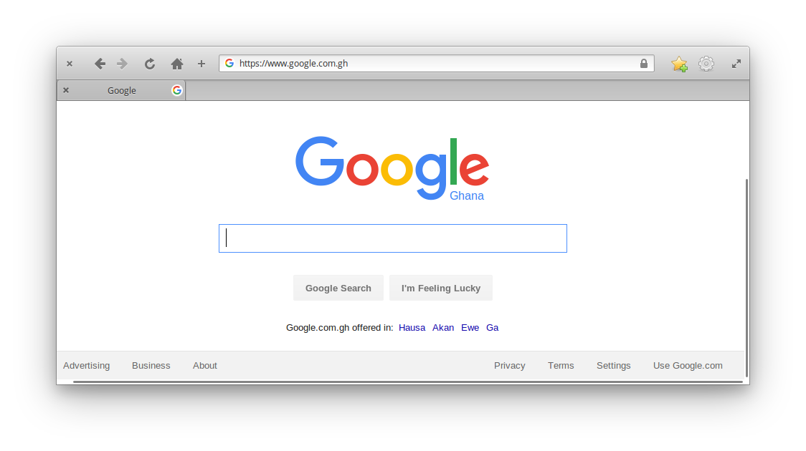

# CHAPTER 1: INTRODUCTION
In this chapter, you will learn some basic concepts and requirements for developing web applications. It is recommended that you read this chapter thoroughly to learn these basic concepts involved in web application development which are necessary to understand subsequent chapters of this book. After completing this chapter, you should be well equipped with the fundamental knowledge needed to start developing web applications.

The summary of the various section are outlined below:

* Learning about the Internet
* The World Wide Web
* Web Applications
* Tools for designing web applications
* Summary
* Key terminologies

## Learning about the Internet
If you have been around for a while, you may have realized that the Internet is at the center most emerging technologies for communication. To be able to develop your web application, you first need to understand the Internet and how it works.

The Internet is basically a network of computers connected to one another all over the world — a worldwide network of interconnected computers.  The Internet provides a way for computers and other electronic devices at different locations to communicate with one another. Once computers are connected to the Internet, we can use them to share information. For computers to be compatible with one another, there are established *rules* for communicating through the Internet known as *communication protocols*. One example of these protocols is the __Hypertext Transfer Protocol (HTTP)__ which is the _main_ communication protocol used for sharing information.

In order for computers to share information, web server and client softwares were developed to use these protocols (rules) for communication. One example of an HTTP web server software is the Apache web Server.

> __NOTE:__ The term __server__ or __web server__ may either refer to a server software or a dedicated computer hardware specially designed for running a web server software _depending on the context_. The same thing applies to __clients__. Therefore you should consider the context within which those terms are used to actually understand what a person may be saying. 

Every computer connected to the Internet is automatically assigned a unique number by their __Internet Service Provider (ISP)__ which usually looks like `192.168.23.44` called an Internet Protocol (IP) Address. An IP address distinguishes one computer from another when they are both connected to the Internet. Once a computer knows the IP Address of another on the Internet, they can communicate.

Since an IP Address number like `192.168.23.44` can be difficult to remember, **Domain Names**, which looks like `example.com`, were invented to make things easy for people. So instead is of having to remember a number like `192.168.23.44`, you can register for a domain name from a Domain Name registrar which points (translates) to your IP address. With the advent of Domain Names, users are not required to know the IP Address of other computers on the Internet to communicate them.

## The World Wide Web 
The World Wide Web (WWW) or **Web** is one of the many efforts to use the Internet to create a platform where we can share information. It involves the use of _Web Applications_. The HTTP protocol plays a major role in web applications by defining rules on how computers must communicate or share information.

This effort led to the invention of technologies such as the Hypertext Markup Language (HTML), Cascade Stylesheet (CSS) and JavaScript. Web browsers were then built as *clients* for accessing web applications built with HTML, CSS and JavaScript. These three technologies _and others_ are collectively called _Web Technologies_. Web Technologies have been improved over time and have gained more capabilities. The current version of HTML is version 5 (HTML5), CSS is version 3 (CSS3), and JavaScript is ECMAScript 6. Chapter 2, 3 and 4 of this book are reserved for HTML, CSS and JavScript respectively.

## Web Applications
As stated earlier, web browsers were created for accessing web applications on the Internet. There are several web browsers available to use which include  Mozilla Firefox, Google Chrome, and Internet Explorer (currently Microsoft Edge). When you first launch your web browser, you are presented with components such as a title bar, menu bar, address bar and the view where page contents are displayed. If you are connected to the Internet and you enter `Google.com` in your address bar, the web browser will communicate with the __Domain Name System (DNS)__ server of Google.com which will redirect your web browser to the IP Address of Google's server to request the Google Search web application. The server will respond by serving you with the Google Search web application which will be downloaded and then displayed in your web browser as seen below. 

Google Search web application loaded in a web browser

The process through which the web browser (client) requests and receive the Google Search web application as explained above is illustrated in the diagram below

Diagram of process here Client -> Server -> Client

> __NOTE:__ The term __website__ is sometimes used in-place of __web application__ which usually refers to the same thing. This book however will maintain the use of __web application_. 

The contents downloaded may include the HTML, CSS, JavaScript and other web technologies used to develop the Google Search web application. The browser will take care of interpreting the contents downloaded to present you with the web application. A web application may have one or more __web pages__ which the user can visit.

Diagram of process here Client -> Server -> Client

## Tools for designing web applications
Developing a web application require certain tools to assist the development process. These requirements are as follows;

* __Computer__: You will need a computer (Desktop or Laptop) to develop a web application. Any computer with either Windows, Linux or macOS installed should be enough.
* __Web browser__ : A Web browser is a computer application are designed to read, interpret and render pages in a web application. You will need the latest version of either Mozilla Firefox, Google Chrome, Opera, IE Edge, or any other modern browser with good support for HTML5 and CSS3. The web browser will be used to view and test web applications as we develop them.
* __Code editor (text editor)__: A code editor is a computer application used for writing computer code. You will need a text editor to write the HTML, CSS and JavaScript source codes for your web application. There are many code editors available to use for development. You can download and install *Atom text editor* for free at https://atom.io.

> __NOTE__: Although I will be using Atom text editor and Firefox web browser for development, you are not required to have those same tools. There are other modern web browsers and text editors depending on your preference.

## Summary

* Computers all over the world form a world-wide network called the Internet through which people are able to share information with each other. 
* The World Wide Web is one way the Internet is utilised to shared information by creating web application which run in web browsers.
* Domain Names were invented to make it easy to locate web applications on the web instead of IP Address numbers.
* Web applications are developed with HTML, CSS, and JavaScript and can be accessed using web browsers which downloads and displays it to the user.

> ## Key Terms
> * __Web Application:__
> * __HTTP Protocol:__ 
> * __Internet Service Provider (ISP):__
> * __Source Code:__
> * __Domain Name System (DNS):__
> * __Domain Name registrar:__
> * __Page Rendering:__
> * __Web pages:__