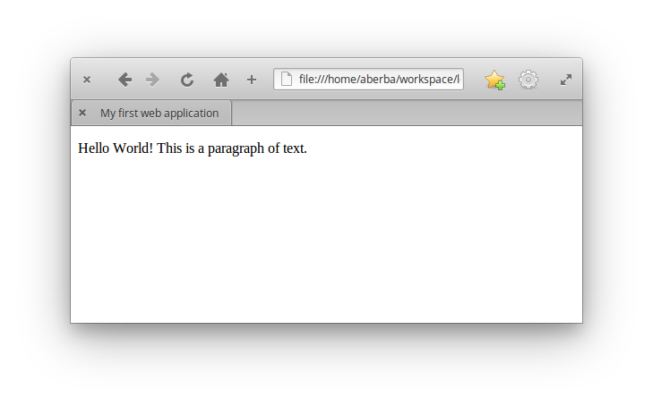
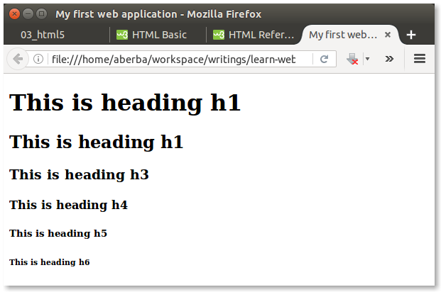
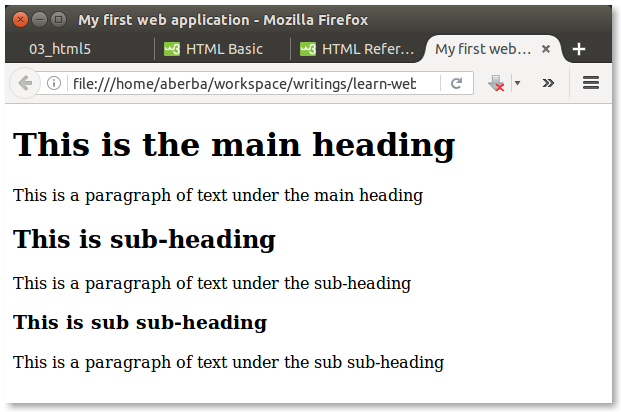
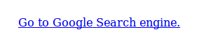

# CHAPTER 2: HTML
In this chapter ...

## What is HTML?
Hypertext Markup Language (HTML) is a markup language with a *specific syntax* used to describe how a web browser (the client) should display a web page and its contents. The contents of a web page which may include text, images, audio, and videos are *each* displayed using  pre-defined **HTML elements**. An HTML element describes the type of content (text, audio, video, etc.) to the browser. Each element is made-up of an **opening tag** and a **closing tag**. The structure of a single HTML element is as follows;

```html
<TAGNAME> CONTENT </TAGNAME>
```

The opening tag marks the beginning of the content to be displayed and the closing tag marks the end. For example, a paragraph of text on a web page will be represented with a *paragraph element* as follows;

```html
<p>Hello, this is a paragraph of text.</p>
```

As you can see above, the paragraph element has an opening tag (`<p>`) to mark the start of the paragraph and a closing tag (`</p>`) to mark the end. The opening tag is prefixed with a less-than symbol (`<"`) and suffixed with a greater-than symbol (`">`) which both wrap around a `"p"` (the tag name). The closing tag is similar to the opening tag except it has a forward slash symbol (`"/"`) immediately after it's less-than symbol which identifies it as a closing tag. The content of the paragraph element (in this case `"Hello, this is a paragraph of text."`) is then be placed within the opening and closing tags. 

The same pattern applies to all other HTML elements. However, there are some few cases where some HTML elements are self-enclosing (only uses an opening tag without any closing tag). Those exceptions will be discussed in subsequent section of this chapter.

## Creating an HTML document
An _HTML document_ is any file which contains HTML markup that specify how the various elements (text, images, audio, video, etc.) on a web page should be displayed (rendered) in a web browser. An HTML file has a `".html"` extension which is recognised by the web browser as web page. 

To create an HTML document, open your text editor (Atom), create a new file and save it as `"index.html"` (notice the `".html"` extension). 

>>
>>Creating an HTML document

After creating and saving the new HTNL document, type the following markup exactly as seen below into the file in your text editor;

```html
<!DOCTYPE html>
<html lang="en">
    <head>
        <title>My web application</title>
    </head>
    <body>
        <p>Hello, this is a paragraph of text.</p>
    </body>
</html>
```
The first line of the markup (`<!DOCTYPE html>`) is called the **Doctype Declaration** . A doctype declaration is a statement which tells the browser the version of HTML being used. In our case, we are using HTML version 5 (HTML5) which is the latest version as discussed in __Chapter 1__. The previous versions of doctype declaration are not discussed in this book and it is recommended to use HTML5 which is an improvement over previous versions.

> __NOTE__: From this point onwards, HTML elements will be represented by their **tag names**. Therefore, whenever you come across the use a tag name like `<p>` in any statement, you should know that it refers to its HTML element. 

Right after the doctype declaration is an  `<html>` element which wraps around all other elements in the document. The `<html>` element instructs the web browser to render everything within it as HTML markup. It has a `'lang="en"'`attribute, placed inside its opening tag,  which tells the browser to display the contents of the web page in the English language (HTML attributes will be discussed later in this book). It also contain two __child elements__: the `<head>` and `<body>` elements, each of which contain their own child elements. 

> __Child elements:__ Any HTML elements which is placed within another element is the child of the outer element. The outer element becomes the parent element.

The `<head>` element is the first child of the `<html>` element. In the example above, it contains a single `<title>` element which specifies the title of the page. The content of the `<title>` elements is the text `"My  web application"` which will be displayed at the top of the browser window. The `<head>` element may also contains other child elements as well. Most other child elements in `<head>` are meant to instruct the browser on how to render the page, therefore their contents are not visible in the browser.

The `<body>` element which is next to the `<head>` element contains the main contents of the web document. In the example above, the `<body>` element contains a single `<p>` child element which contains the text `"Hello, this is a paragraph of text."`. This text will be displayed when the document is viewed in a web browser.

To view this document, save it to your computer and open it with your web browser. If you typed everything correctly, it should look like the image shown below;


A preview of our sample web page

> __NOTE:__ The browser does not display the tags themselves but only their content since the tags are only meant to specify the type of content, as well as, the beginning and end of the content.

As seen in the image above, the title of the web page (which we placed in the `<title>` element) should also be displayed at the top of the browser window. 

> __NOTE:__ The position where the __page title__ is displayed depends the type of the web browser you are using (Firefox, Chrome, IE Edge, etc.) and how is was designed.  

## Learning the common HTML elements
As discussed in __Chapter 1__, web pages in a web application are made up of various HTML elements which may vary depending on the type information they display (text, images, audio, video, etc). The structure and hierarchy of an HTML document is shown below;

> 

The diagram above illustrates how HTML elements are ranked in a hierarchical order (from top to bottom). The doctype declaration is the first in every HTML document. It is followed by the `<html>` element which contains all other elements. Some of the commonly used HTML elements are outlined below;

### The `<html>` element
As discussed previously, the `<html>` element contains all other elements on a web page, except the doctype declaration.

> ### HTML attributes
> An HTML attribute adds more meaning and context to an HTML element. It is placed in the opening tag of an HTML element to instruct the web browser on how to display the contents of that particular element. An example of an HTML attribute is the `lang` attribute of the `<html>` element which has a value of `en` to indicates that all the text on the web page is written in English Language. An HTML attribute is made up of a __name__ and __value__ pair. In the case of the `<html>` element, `"lang"` is the name of the attribute and `"en"` is the value. The value of an HTML attribute is wrapped in quotes.
> 
> Some attributes are __global__ and can be used on _any_ HTML element whilst others are __non-global__ and are used on _specific_ elements. Few examples of the global attributes are as follows;
> 
> Attribute Name | Description
> -------------- | ------------ 
> lang | Specifies the language of the element's content
> title | Used to add extra information about an element
> class | Specifies one or more class names for an element. This attribute is discussed Chapter 3.
> id | Specifies a unique id for an element. This is also discussed in Chapter 3.
> 
> You can further research on the other global attribute. Non-global attributes are discussed in subsequent sections in this Chapter.

The `<head>` and `<body>` elements are the only two children of the `<html>` element and are discussed below;

### The `<head>` element
The `<head>` element is the first child of the `<html>` element. It may also contain child elements which provide more information about the web document and instructs the browser on how to render it. These information may include the page title, character encoding, description of the page content, viewport size and many more. These topics will be discussed later in this book. The `<title>` element which specify the title of the web page is discussed below. 

### The `<title>` element
The `<title>` element is a child of the `<head>` element. It specifies the title of a web page as it's name implies. The content is any text which will be displayed at the top of the browser window as the page title. It is best to give every web page a _unique_ title to distinguish it from the other pages.

```html
<!DOCTYPE html>
<html>
  <head>
      <title>Another web application</title>
  </head>

</html>
```

### The `<body>` element
The `<body>` element is next after the `<head>`. As discussed previously, all information meant to be visible in the browser should be placed in the `<body>` element. Contents such as text, images, audio, video, etc. are all placed within the `<body>` element.

> __NOTE__: HTML elements discussed henceforth _may_ have HTML markup below it to demonstrate how it is used. Markup demonstrated may ignore other elements and only show the specific element under discussion for simplicity sake. You are expected to type the markup within the `<body>` element of a complete HTML document to test it in your web browser. A template markup is demonstrated below:
> 
```html
<!DOCTYPE html>
<html>
  <head>
      <title>My web application</title>
  </head>
  <body>
      ... All demonstrated HTML markup should be placed here for testing ...
  </body>
</html>
```

The list of some commonly used HTML elements which are placed within the `<body>` element are discussed below with demonstrations.

### The `<p>` element
The `<p>`  element represents a paragraph of text. The text content is placed within opening and closing tags. A web page may have one or more paragraphs of text as shown below;

```html
<p>I am a paragraph of text.</p>
<p>I am another paragraph of text</p>
```

### The comment element
The comment element is used to markup a piece of text as a comment. Comments are not be rendered by the web browser but are useful for documenting HTML markup for the developer to know what the code does. The comment element is unique in that, it begins with a `<!--"` and ends with a `"-->` as show below:

```html
<!-- This comment marks the first paragraph -->
<p>I am a paragraph of text.</p>

<!-- This comment marks the second paragraph -->
<p>I am another paragraph of text</p>
```

Comments may also span across multiple lines:

```html
<!-- This is a very long comment which occupy 
multiple lines in a document. It is appropriate 
to not make comments as short as possible and 
till contain the necessary information -->
```

Simple HTML markup usually do not need comments since they are easy to understand. However, comments are needed in cases where the web document contains a more complex of markup to explain things to other developers.  

### The Heading elements
There are six different types of HTML heading elements used to markup certain piece of text as headings. The heading elements rank from `<h1>` to `<h6>`. The `<h1>` is the highest in the rank representing the most important heading whilst the `<h6>` element is the lowest in rank and least important. The use of heading elements is as follows;

```html
<h1>This is heading h1</h1>
<h2>This is heading h2</h2>
<h3>This is heading h3</h3>
<h4>This is heading h4</h4>
<h5>This is heading h5</h5>
<h6>This is heading h6</h6>
```

The sizes of the text in the heading elements decrease from the highest to the lowest rank. As shown below;



These varying sizes of heading elements can be used to represent the main headings and sub-headings of a piece of text on a web page. An example of using heading elements in a paragraph of text is shown below;

```html
<h1>This is the main heading</h1>
<p>This is a paragraph of text under the main heading</p>

<h2>This is sub-heading</h2>
<p>This is a paragraph of text under the sub-heading</p>

<h3>This is sub sub-heading h3</h3>
<p>This is a paragraph of text under the sub sub-heading</p>
```

The document should look similar to the image below;




### The `<em>` element 
 This element is used for emphasising a peace of text. An emphasised text will be displayed italics.

 ```html
 <p>I am <em>really</em> excited about HTML.</p>
 ```


### The `<strong>` element 
 This element is used to mark a piece of text as important. Any piece of text placed within the `<strong>` element will usually be displayed in bold.

```html
 <p>The meeting will start at <strong>12:00pm</strong> prompt.</p>
```

> ### HTML elements with no closing tag
> As mention _earlier (link)_, some elements do not have closing tags and are self-enclosing. Henceforth, you may encounter such elements.

### The `<br>` element 
The __line break__ element is used to force an element onto a new line. The `<br>` is one example of elements with a self-enclosing tag. Any element that come after a `<br>` element will be displayed in a line below:

```html
   <!-- A paragraph with no line break -->
  <p>Hello, this is a paragraph of text.</p>

  <!-- A paragraph with a line break -->
  <p>Hello, this is a <br> paragraph of text.</p>
```

The following should be displayed as shown below:


Paragraph with `<br>` vs Paragraph without `<br>`.


### The `<hr>` element 
This element displayed a horizontal rule (line) which defines a thematic break in a web page. This is particularly useful for representing a shift of topic in a piece of writing. The `<hr>` element is self-enclosing.

 ```html
    <h1>About Cars</h1>
    <p>Cars are very unique in their ...</p>

    <hr>

    <h1>About bikes</h1>
    <p>Bikes are convenient for travelling ...</p>
 ```


### The `<a>` element 
This element is used to represent a hyperlink. A hyperlink has an `"href"` attribute and accepts a Uniform Resource Locator (URL) as its value. A URL is ... The URL value of an `href` attribute may point to a section of the same web page, another web page or a different website.

```html
<a href="https://google.com">Go to Google Search</a>
```

A hyperlink is usually displayed in blue colours. The URL set as its value is not displayed but when clicked, your web browser will be directed to that URL. Only the text played between the tags is displayed in blue as shown below:


A hyperlink to "https://google.com"

A hyperlink may also be link to another section of the same web page. The element at the section where the link must point to should be given an `"id"` attribute. The value of the `"id"` attribute should be set as the value of the hyperlink's "href" attribute prefixed with a `"#"`:

```html
<!-- Two hyperlinks with no <br> between them -->
<a href="#section-one">Go to Section One</a>
<a href="#section-two">Go to Section Two</a>

<!-- Section One -->
<p id="section-one">This is section one with</p>

<p id="section-two">This is section two with</p>
```


When you test the example above, a click on the `Go to Section One` hyperlink should direct your browser's view to the element with an `id` attribute of `section-one`. Same thing applies to the `Go to Section Two` hyperlink.

> ### Relative and absolute URL paths
> A URL of a hyperlink may either have a relative or an absolute path. A relative path ...


### The multimedia elements
In this modern era, multimedia content such images, audio and video form a major part of information we consume. HTML specification provides elements form displaying these type of content on a web page.

### The `` element 
The img element is used to display images on a web page. It supports an `src` attribute for linking the image to be displayed in the element. The value of the `src` attribute is the URL to the image file to be displayed. The ``` element also support an `alt` attribute which accepts a text as its value. The text __describes what is found in the image__. This text serves as an alternative to be displayed in-case the image fails to load and its very helpful for __screen readers__ used by people with impaired eyesight. It is _highly recommended_ to specify an alternative text for every image as a fallback measure to inform users when an image fails to load. Failure may be attributed to a server error or an invalid URL.

> A __screen reader__ is a softwares used by people who have impaired eyesight to reads text found computer screen for them to listen as an audio (voice).

```html

```

Images available locally can also be linked using an _absolute URL_. For example, an image file located in the same folder as when you have stored the HTML document can be linked be specify the absolute path as shown below:

```html

```
It is recommended to create a new folder where all images are placed separately. For example, a folder named `images` can be created and placed in the same location as the HTML document. Supposing the `photo.jpg` file is moved the the images folder, the absolute path to it, `images/photo.jpg`, can then be specified as the value of the `src` attribute.

```html

```

> ### Web image formats
> All image file names may either end with a `.jpg`, `.png`, `.gif`, etc. This is called the __image extension__. An image extension indicates the format of a particular image. There are several images formats available but not all of them are supported for displaying on a web page. Some of the commonly supported image formats are illustrated below:

> Format | Extension | Description
> ------ | --------- | -------------
> (PNG)  | .png | Used
> (JPG) | .jpg | used
> (JPEG) | .jpeg | used
> (GIF) | .gif | used for animated images
> (WEBP) | .webp | used

### The `<picture>` element 
__REFERENCE?? FIX writeup__

### The `<figure>` element 
This element is used to mark-up a piece of content as a whole (self-containing) — like illustrations, diagrams, photos, code listings, etc. 

A `<figure>` element may be used to wrap an a group of images as belonging together. The `` element then becomes a child of the `<figure>` element:

__FIX: ADD <picture> in code below ??__

```html
<figure>
  
</figure>
```

It is recommended to place all `` elements and their captions in a `<figure>` elements to mark the as belonging together.

### The `<figcaption>` element 
This element is used to add a caption to a `<figure>` element. A `<figcaption>` accepts a piece of text and its placed within `<figure>` element to serve as a label, provide information about the figure's purpose, intellectual owner, where a photo in a figure was taken, etc. 

```html
<figure>
  
  <figcaption>Figure 1: John Asante, my step brother</figcaption>
</figure>
```

The text in a `<figcaption>` element is not meant to describe _what is happening an image_ (visual content) — which is the role of the `alt` attribute of an `` element.


### The `<audio>` element 


### The `<video>` element 
.................................
....................................
................................... 


### The list elements
List elements are used to markup content in the form of a list. There are different list elements which may either be `<ol>`, `<ul>` or `<dl>`. 

#### The `<ol>` list element
This list element is used to create an ordered list. Each item in an `<ol>` list is defined with a `<li>` child element. Ordered list are numbered starting from number `"1"` by default.

```html
<ol>
    <li>List item one</li>
    <li>List item two</li>
    <li>List item three</li>
</ol>
```

An order list support HTML attributes in addition to the global attributes for customising how the list are displayed. Some of the attributes supported by `<ol>` are listed in the table below.

Attribute | Description | Value
--------- | ----------- | ----------------
start | Specifies the number the list should start from a certain number | any number 
reversed | Specifies that the list should be numbered in a descending order | reversed 
type | Specifies the kind of marker to use in the list | 1, A, a, I, i 

The following list will be made to start numbering from `"3"` using the `"start"` attribute:

```html
<ol start="3">
    <li>First list item</li>
    <li>Second list item</li>
    <li>Third list item</li>
</ol>
```
We can also customize the a list to be numbered in a _descending order_ using the `"reversed"` attribute.

```html
<ol reversed="reversed">
    <li>First list item</li>
    <li>Second list item</li>
    <li>Third list item</li>
</ol>
```

#### The `<ul>` list element
This list element is used to create an unordered list. Unordered list are bulleted by default. 

```html
<ul>
    <li>List item 1</li>
    <li>List item 2</li>
    <li>List item 3</li>
</ul>
```

#### The `<dl>` list element
This list element is used to create a description list. Each item in a `<dl>` list is a term and description pair defined using a `<dt>` element (the term) and a `<dd>` element (the description).

```html
 <dl>
  <dt>Tomato</dt>
  <dd>A red pulpy vegetable for preparing sauce.</dd>

  <dt>Cassava</dt>
  <dd>A root tuber crop.</dd>
  
  <dt>Apple</dt>
  <dd>A sweet little fruit.</dd>
</dl> 
```

### Semantic HTML elements
Semantic elements are used to give meaning to a page structure. It is important for defining how the various sections of a web page are marked up. This is especially needed for Search Engines (like Google Search) and screen readers (programs used by visually impaired people for reading). The use of each  of semantic element is apparent in its name. Some of the commonly used semantic HTMl elements are outline below.

#### The `<main>` element
The element specifies the main content of a web page. The content placed inside the `<main>` element should be unique to the document. It should not contain any content that is repeated across documents such as sidebars, main navigation links, copyright information, site logos, and the like. 

Also, there should not be more than one `<main>` element in a document. The <main> element must __NOT__ be a child of an <article>, <aside>, <footer>, <header>, or <nav> element which are discussed subsequently.


#### The `<article>` element
This element is used to markup a piece of content as independent from the rest of the contents on a web page. The `<article>` element may be used to markup a blog post, an article, comments or any other content which is less related to the other contents on a web page:

```html
<main>
    <!-- This is the main post -->
    <article>
        <h1>My new blog post</h1>
        <p>Today, I want to talk about a conference I attended weekend ...</p>
    </article>

    <!-- Comments from users are marked up below -->
    <article>
        <h1>Comments from readers.</h1>

        <ol>
            <li> <strong>John said:</strong> Hello, I really enjoyed reading.</li>
            <li> <strong>Janet said:</strong> Nice post.</li>
        </ol>
    </article>
</main>
```

#### The `<section>` element
This elements is used to markup a web page into different sections. Any part of a web page may be divided into separate sections containing a specific kind of information. The `<section>` element is useful for dividing a document into various sections especially when there are a lot of content to deal with.

Another use case for `<section>` is for separate the header of a web page into separate sections (logo section, main navigation section). You may also use the section element to represent each comment posted by a reader of a blog post:

```html
<main>
    <article>
        <h2>Comments from readers</h2>

        <!-- first section -->
        <section>
            <h3>Jane Doe said:</h3>
            <p>I really enjoy reading your blog posts.</p>
        </section>

        <!-- second section -->
        <section>
            <h3>Mike Okran said:</h3>
            <p>Nice post.</p>
        </section>
    </article>
</main>
```


#### The `<header>` element
This element is used to markup the introductory part of a content on a web page. Each web page usually have a `<header>` element to mark the main header (topmost part) of the page where the page logo, main title and main navigation links (main menu) are placed. It may also be used to represent the introductory content within a `<section>` element.

```html

    <header>
        <h1>Welcome to my website</h1>
        

        <ul>
            <li><a href="index.html">Home</a></li>
            <li><a href="index.html">My Blog</a></li>
            <li><a href="index.html">About Me</a></li>
        </ul>
    </header>

    <main>
        <article>
            <h1>Title of blog post</h1>

            

            <p>Lorem ipsum dolor sit amet, consectetur adipisicing elit, sed do eiusmod tempor.</p>

        </article>
    </main>
```

#### The `<nav>` element
This element is use to represent the a set of navigations links. The `<nav>` element can be used to markup __main navigation links__ (usually located within the main header at the top part of a web page). It is appropriate to place individual links of a `<nav>` element in an unordered list (`<ul>`).

```html
    <!-- header containing main navigation -->
<header>
    <h1>Welcome to my website</h1>
    <nav>
        <ul>
            <li><a href="#">Home</a></li>
            <li><a href="#blog">Blog</a></li>
            <li><a href="#about">About Me</a></li>
        </ul>
    </nav>
</header>

<!-- The rest of the page linked to the navigation -->
<main>
    <article>
        <section id="top">
            <h2>Top Section</h2>
            <p>This is the top section of the page</p>
        </section>

        <section id="top">
            <h2>Blog posts</h2>
            <p>This is the top section of the page</p>
        </section>

        <section id="top">
            <h2>This is a title for this page</h2>
            <p>This is the top section of the page</p>
        </section>
    </article>
</main>
```


Other __group of hyperlinks__ on different parts of a web page can also be placed inside a `<nav>` element (see the `<aside>` element below).

#### The `<footer>` element
Similar to the `<header>` elements, the `<footer>` element is used to represent the ending part of a piece of content on a web page. The footer element may be used to represent the main ending part of a web page which may contain copyright information, related content and contact information of the web:

```html
<!-- header for page with my logo -->
<header>
    <h1>Welcome to my website</h1>
    <ul>
        <li><a href="index.html">Home</a></li>
        <li><a href="index.html">My Blog</a></li>
    </ul>
</header>

<!-- main content -->
<main>
    <article>
        <!-- blog post section -->
        <section>
            <h1>This is the title of my blog post.</h1>

             <!-- this is an image for my post -->

            <p>A paragraph of text for a blog post. It can be long or short depending on the writer. As a convention is writing, it is appropriate to not make paragraphs too long.</p>

            <h2>A subtitle of the post</h2>
            <p>Another paragraph of text under the subtitle. Just to demonstrate how various elements can be combined to lay out content on a web page.</p>
        </section>
    </article>

    <article>
       <!-- Another blog post can be placed here -->
    </article>
</main>

<!-- Footer containing address and copyright information -->
<footer>
    <h3>Contact Us</h3>
    <p>Oxford Road, Accra - Ghana</p>

    <p>Copyright Jonathan Seidu, 2016. </p>
</footer>
```


#### The `<aside>` element
An "aside" is the section of a web which contains content __aside__ from the content it is placed in. It usually contains group of links to other web pages aside from the main navigation. Aside are commonly placed at the leftmost or rightmost section of a web page by styling it with CSS (see Chapter 3).

```html
<!-- header for page with my logo -->
<header>
    <h1>Welcome to my website</h1>
    <ul>
        <li><a href="index.html">Home</a></li>
        <li><a href="index.html">My Blog</a></li>
    </ul>
</header>

<!!
<aside>
    <h2>Extra links</h2>
    <ul>
        <li><a href="mavis-gallery.com">My photo gallery</a></li>
        <li><a href="movie-gallery.com">My favourite movies</a></li>
        <li><a href="fruits-gallery.com">My favourite fruits</a></li>
    </ul>

    <h2>My social media accounts</h2>
    <ul>
        <li><a href="facebook.com">Facebook</a></li>
        <li><a href="twitter.com">Twitter</a></li>
    </ul>
</aside>

...

```

Finis multimedia elements


> ## Key Terms
> **Rendering** 
> * **Markup**:
> * File __extension__
> * Tag
> * Markup
